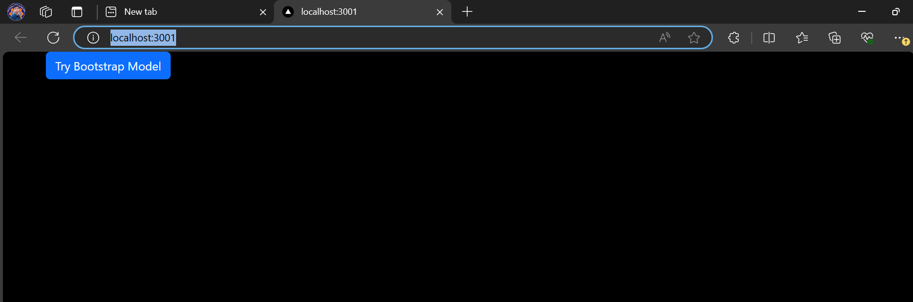
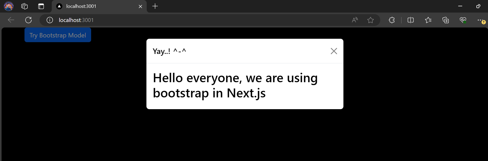
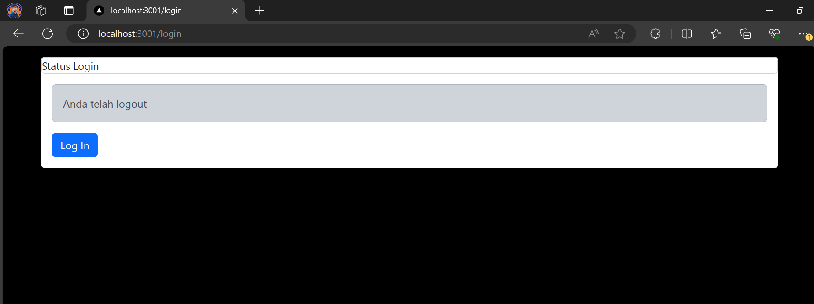
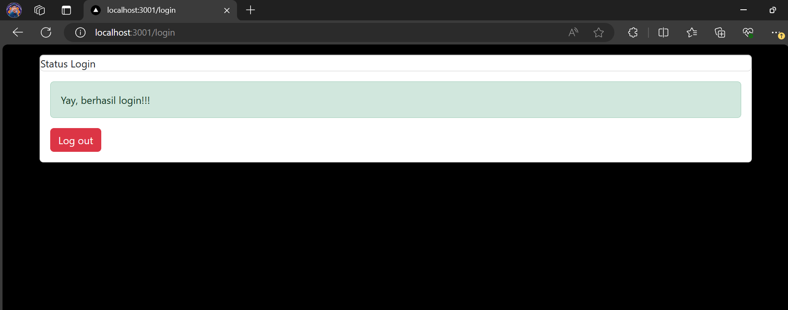
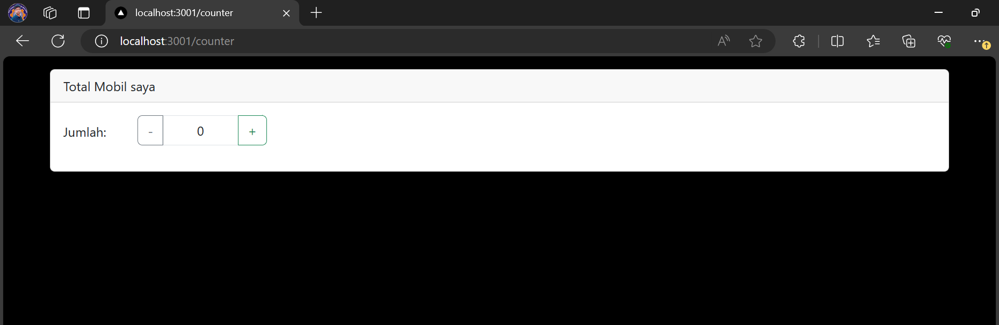
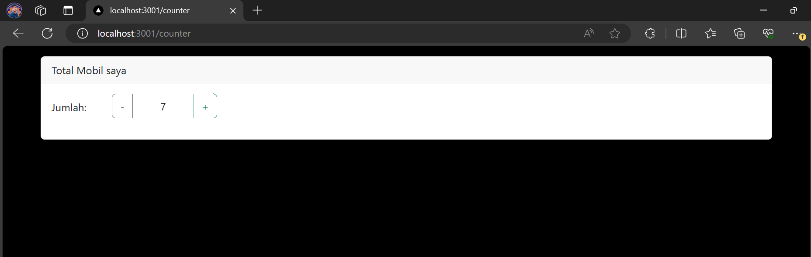
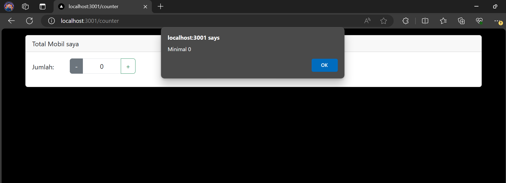

## Laporan Praktikum

|  | Pemrograman Berbasis Framework 2024 |
|--|--|
| NIM |  2141720269|
| Nama |  Muhammad Asad |
| Kelas | TI - 3I |

## Assignment Answers

1. import { useEffect } from "react"; is used to import the useEffect hook from the React library. useEffect is a hook that lets you perform side effects in function components. It is like a combination of componentDidMount, componentDidUpdate, and componentWillUnmount lifecycle methods in class components.

2. If you remove useEffect from your component, any code within that useEffect will not be executed. This could lead to different behaviors depending on what the useEffect is doing. For example, if it's used for fetching data when the component mounts, the data will not be fetched.

3. In JSX, which is a syntax extension for JavaScript used by React, you can't use the class keyword because it's a reserved word in JavaScript. Instead, you use className to add CSS classes to JSX elements.

4. Yes, the store in Next.js can store many Redux reducers. You can combine them using the combineReducers function from Redux.

5. The store.js file is typically where you create your Redux store. This is where you'd combine your reducers, apply middleware, and possibly add support for the Redux DevTools extension.

6. const { isLogin } = useSelector((state) => state.auth); This line is using the useSelector hook from react-redux to access the auth state from the Redux store. It's extracting the isLogin property from the auth state.

7. const {totalCounter} = useSelector((state) => state.counter); This line is similar to the previous one, but it's extracting the totalCounter property from the counter state in the Redux store.
